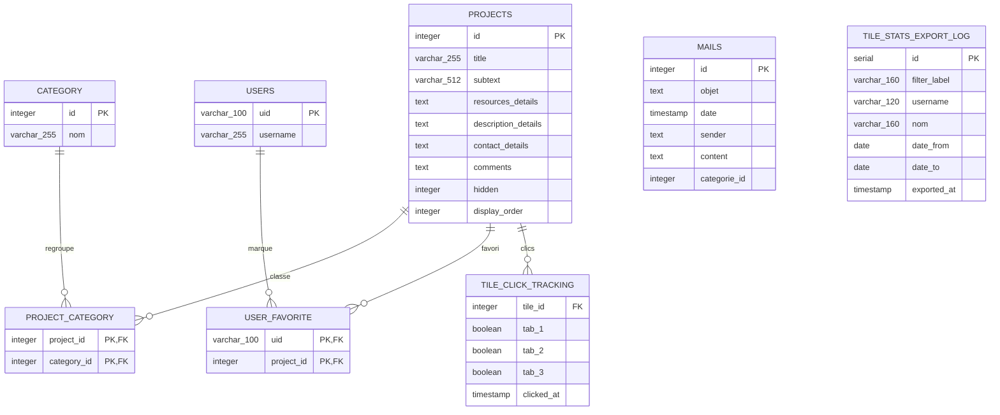

# Representation de la base de donnees

Etat reconstruit depuis `init_db/gpt_venus_preprod_ready.sql` et les migrations presentes dans `init_db/`.

## Tables

### `projects`

Table centrale des tuiles/projets affiches dans l'application.

| Colonne | Type | Contraintes / defaut |
| --- | --- | --- |
| `id` | `integer` | PK, sequence `projects_id_seq` |
| `title` | `varchar(255)` | NOT NULL |
| `subtext` | `varchar(512)` | DEFAULT `'test'` |
| `resources_details` | `text` | nullable |
| `description_details` | `text` | nullable |
| `contact_details` | `text` | nullable |
| `comments` | `text` | nullable |
| `hidden` | `integer` | DEFAULT `0` |
| `display_order` | `integer` | nullable |

### `category`

Categories de classement des tuiles.

| Colonne | Type | Contraintes / defaut |
| --- | --- | --- |
| `id` | `integer` | PK, sequence `category_id_seq` |
| `nom` | `varchar(255)` | NOT NULL |

Valeurs presentes dans le dump :

| id | nom |
| --- | --- |
| 1 | Vie de l'etudiant |
| 2 | Vie de la formation |
| 3 | Vie de l'etablissement |

### `project_category`

Table de liaison many-to-many entre les tuiles et les categories.

| Colonne | Type | Contraintes / defaut |
| --- | --- | --- |
| `project_id` | `integer` | PK composee, FK vers `projects.id`, `ON DELETE CASCADE` |
| `category_id` | `integer` | PK composee, FK vers `category.id`, `ON DELETE CASCADE` |

Index :

| Index | Colonnes |
| --- | --- |
| `idx_project_category_project_id` | `project_id` |
| `idx_project_category_category_id` | `category_id` |

### `users`

Utilisateurs connus par l'application pour les favoris.

| Colonne | Type | Contraintes / defaut |
| --- | --- | --- |
| `uid` | `varchar(100)` | PK |
| `username` | `varchar(255)` | NOT NULL |

### `user_favorite`

Favoris par utilisateur et par projet.

| Colonne | Type | Contraintes / defaut |
| --- | --- | --- |
| `uid` | `varchar(100)` | PK composee, FK vers `users.uid`, `ON DELETE CASCADE` |
| `project_id` | `integer` | PK composee, FK vers `projects.id`, `ON DELETE CASCADE` |

### `mails`

Mails collectes, associes a une categorie par defaut.

| Colonne | Type | Contraintes / defaut |
| --- | --- | --- |
| `id` | `integer` | PK, identity `mails_id_seq` |
| `objet` | `text` | NOT NULL |
| `date` | `timestamp without time zone` | NOT NULL |
| `sender` | `text` | nullable |
| `content` | `text` | nullable |
| `categorie_id` | `integer` | NOT NULL, DEFAULT `1` |

Note : le dump ne declare pas de cle etrangere entre `mails.categorie_id` et `category.id`.

### `tile_click_tracking`

Historique des clics sur les tuiles et leurs onglets.

| Colonne | Type | Contraintes / defaut |
| --- | --- | --- |
| `tile_id` | `integer` | FK vers `projects.id`, `ON DELETE CASCADE` |
| `tab_1` | `boolean` | NOT NULL, DEFAULT `false` |
| `tab_2` | `boolean` | NOT NULL, DEFAULT `false` |
| `tab_3` | `boolean` | NOT NULL, DEFAULT `false` |
| `clicked_at` | `timestamp without time zone` | NOT NULL, DEFAULT `now()` |

Index :

| Index | Colonnes |
| --- | --- |
| `idx_tile_click_tracking_tile_id` | `tile_id` |
| `idx_tile_click_tracking_clicked_at` | `clicked_at` |

### `tile_stats_export_log`

Journal des exports de statistiques de clics depuis l'administration.

| Colonne | Type | Contraintes / defaut |
| --- | --- | --- |
| `id` | `serial` | PK |
| `filter_label` | `varchar(160)` | NOT NULL, DEFAULT `'toutes les dates'` |
| `username` | `varchar(120)` | NOT NULL, DEFAULT `'admin'` |
| `nom` | `varchar(160)` | NOT NULL, DEFAULT `'admin'` |
| `date_from` | `date` | nullable |
| `date_to` | `date` | nullable |
| `exported_at` | `timestamp without time zone` | NOT NULL, DEFAULT `now()` |

Index :

| Index | Colonnes |
| --- | --- |
| `idx_tile_stats_export_log_exported_at` | `exported_at DESC` |

## Relations

| Relation | Cardinalite | Suppression |
| --- | --- | --- |
| `projects.id` -> `project_category.project_id` | 1 projet vers N lignes de liaison | cascade |
| `category.id` -> `project_category.category_id` | 1 categorie vers N lignes de liaison | cascade |
| `users.uid` -> `user_favorite.uid` | 1 utilisateur vers N favoris | cascade |
| `projects.id` -> `user_favorite.project_id` | 1 projet vers N favoris | cascade |
| `projects.id` -> `tile_click_tracking.tile_id` | 1 projet vers N clics | cascade |

## Points d'attention

- `mails.categorie_id` ressemble a une reference vers `category.id`, mais aucune contrainte FK n'est declaree dans le dump.
- `tile_click_tracking` n'a pas de cle primaire : c'est un journal d'evenements append-only.
- `tile_stats_export_log` n'a pas de relation directe declaree avec `users`; il stocke `username` et `nom` en texte au moment de l'export.
- La migration `prod_migration_projects_details_20260603.sql` supprime les anciennes colonnes `contact_title`, `resources_title` et `description_title`. Elles ne figurent deja plus dans le dump principal.
